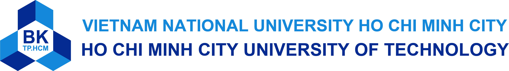

###

# 👋 Hi, I'm Minh Quan 

🎓 Computer Engineering student at Ho Chi Minh University of Technology (HCMUT)  
🔌 Focused on **Embedded Systems & IoT** — ESP32, RTOS, low-level C, sensors, and real-time applications  
⚙️ Experienced with **FreeRTOS**, task scheduling, hardware drivers, and microcontroller programming  
🌐 Developing **full-stack tools** that support embedded workflows (NodeJS, APIs, automation)  
📫 Contact: **minhquan29102005@gmail.com**

---

## 🧠 Technical Profile

### Languages

### Embedded & Hardware

### AI & Software

### Areas of Knowledge
- Embedded Systems
- FPGA Design
- System-on-Chip Architecture
- AI / Machine Learning
- Full Stack Development
- Game Development

### 🧩 Featured Projects

- 

    🎮 <strong>The Linked Journey (Unity)</strong>
    
    
  

  

    Co-op rope-physics platformer with scoring system & gameplay mechanics
  
 

- 

    🤖 <strong>TinyML IoT Platform (ESP32-S3 + FreeRTOS)</strong>
  

  

    Multi-task RTOS system, sensor drivers, LCD + NeoPixel control, and TinyML inference
  
  
  

    Public Repository: https://github.com/quang-tran0/Iot_Project
  
 

- 

    🔥 <strong>Reinforcement Learning – Flappy Bird (DQN)</strong>
  

  

    A Deep Q-Learning agent trained to play Flappy Bird  
  

  

    Public Repository: https://github.com/quang-tran0/DQN-With-FlappyBird
  
 

---

<!-- ### 📊 GitHub Stats

    

    
    

 -->

<!--
**quanminh2910/quanminh2910** is a ✨ _special_ ✨ repository because its `README.md` (this file) appears on your GitHub profile.

Here are some ideas to get you started:

- 🔭 I’m currently working on ...
- 🌱 I’m currently learning ...
- 👯 I’m looking to collaborate on ...
- 🤔 I’m looking for help with ...
- 💬 Ask me about ...
- 📫 How to reach me: ...
- 😄 Pronouns: ...
- ⚡ Fun fact: ...
-->
